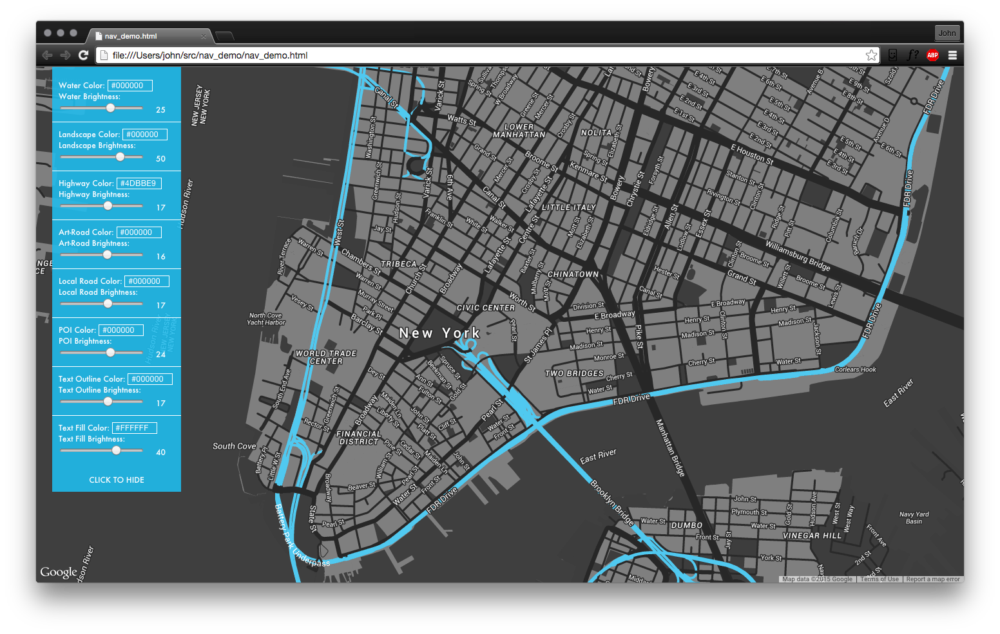
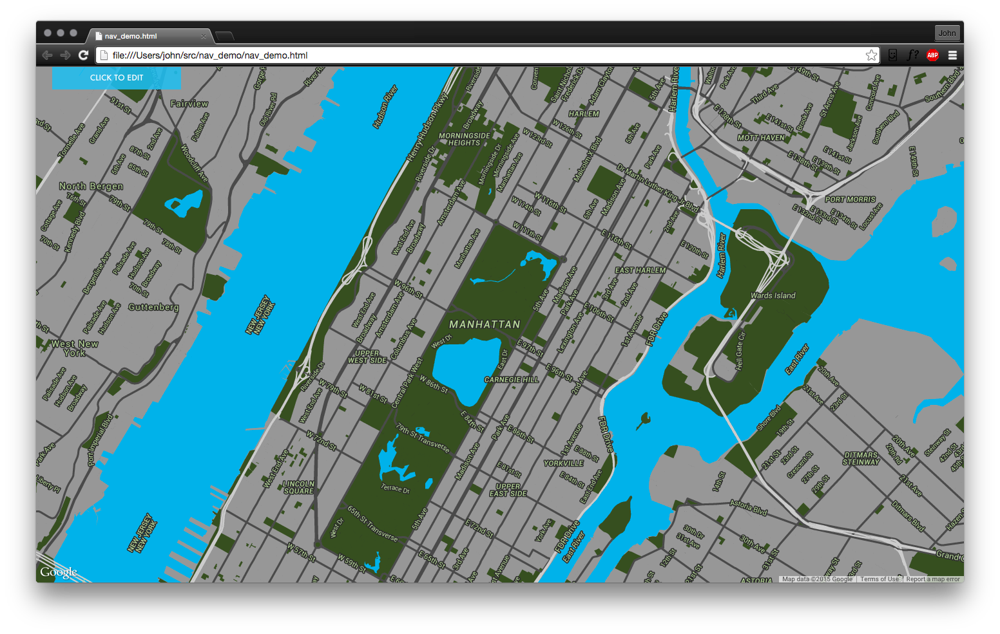
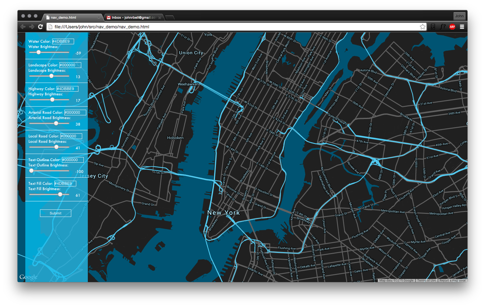
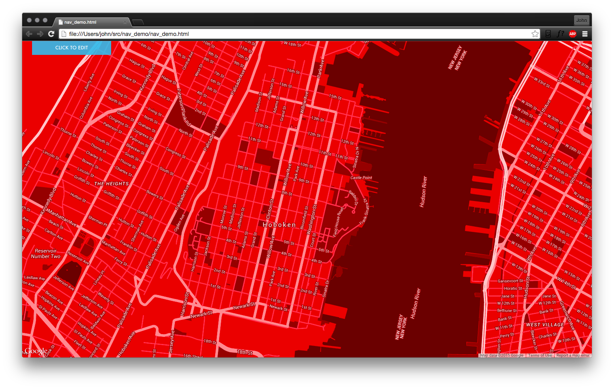

## Exploring Dynamically Styling Google Maps.

Basic layout is HTML and some CSS.

Used jQuery to grab values from the left sidebar.

These are then passed as map_options, and then map.setOptions() is called to set the new attributes.

Map updates on the fly without reloading the page or using another API call.

Purpose is to explore 'theming' an upcoming project related to group-generated travel plans. 

